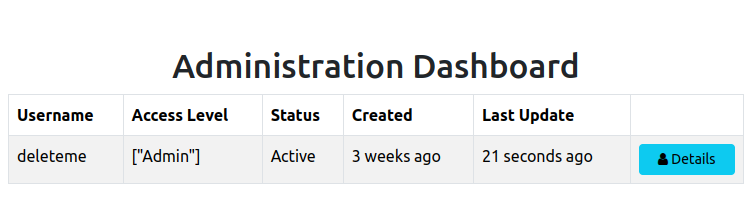
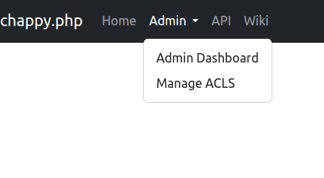
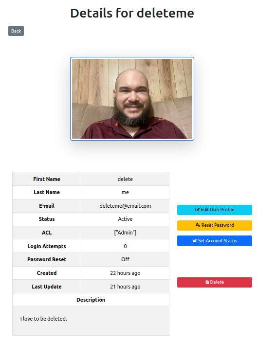
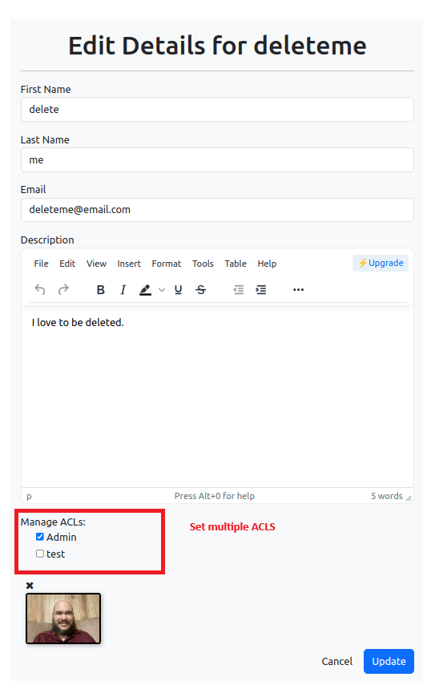

<h1 style="font-size: 50px; text-align: center;">Administration</h1>

## Table of contents
1. [Overview](#overview)
2. [How It Works](#how-it-works)
3. [Administration Dashboard](#admin-dashboard)
4. [Administration Menu](#admin-menu)
5. [Profile Details](#profile-details)
6. [Edit Details](#edit-details)
7. [Reset Password](#reset-password)
8. [Account Status](#account-status)
9. [Delete Account](#delete-account)
10. [Manage Access Control Levels (ACLs)](#manage-acls)

<br>

## 1. Overview <a id="overview"></a><span style="float: right; font-size: 14px; padding-top: 15px;">[Table of Contents](#table-of-contents)</span>
Administration features can be accessed by any user who belongs to the admin group.  This frame work supports the ability for administrators to perform the following tasks:
1. Access the administration dashboard
2. View list of all users
3. View and edit user profiles (useful if a user violates any terms of service agreements)
4. Set the reset and unset the reset password flag for a user
5. Activate or deactivate users
6. Delete users
7. Manage Access Control Levels (ACLs)

> ⚠️ **Security Tip:** Only trusted users should be assigned administrator rights. Admins have full visibility and control over user accounts and system roles.

<br>

## 2. How It Works <a id="how-it-works"></a><span style="float: right; font-size: 14px; padding-top: 15px;">[Table of Contents](#table-of-contents)</span>
A user is granted admin access if their ACL includes `"Admin"`. You can manage ACLs for any user through the admin profile edit form.

```php
if ($user->hasAcl('Admin')) {
    // Show admin dashboard
}
```

Admin-specific routes are protected by ACL checks defined in `acl.json`. Only users with access to the `"Admindashboard"` controller and its actions will be allowed to view these pages.

<br>

## 3. Administration Dashboard <a id="admin-dashboard"></a><span style="float: right; font-size: 14px; padding-top: 15px;">[Table of Contents](#table-of-contents)</span>
The administration dashboard is easily accessible by any user in the admin group by clicking on the `Admin` link in the navigation panel.  Once at the Administration Dashboard the user is presented with a list of all users.  An example of the Administration Dashboard view is shown below in figure 1:

<div style="text-align: center;">
  
  <p style="font-style: italic;">Figure 1 - Administration dashboard index view</p>
</div>

Admins can click buttons to view, edit, reset passwords, or delete accounts.

<br>

## 4. Administration Menu <a id="admin-menu"></a><span style="float: right; font-size: 14px; padding-top: 15px;">[Table of Contents](#table-of-contents)</span>
The navigation bar includes an Administration Menu for users with the Admin ACL. It provides quick access to:
- Administration Dashboard
- ACL Management View 

An image of the Administration Menu is shown in figure 2.

<div style="text-align: center;">
  
  <p style="font-style: italic;">Figure 2 - Administration navbar menu</p>
</div>

<br>

## 5. Profile Details <a id="profile-details"></a><span style="float: right; font-size: 14px; padding-top: 15px;">[Table of Contents](#table-of-contents)</span>
Clicking the "Details" button brings the admin to a user's profile view. It includes:
- Login attempt count
- Password reset flag status
- Creation and last update dates
- Account activation status  

An example of this view is shown in figure 3.

<div style="text-align: center;">
  
  <p style="font-style: italic;">Figure 3 - Administration view of profile</p>
</div>

<br>

## 6. Edit Details <a id="edit-details"></a><span style="float: right; font-size: 14px; padding-top: 15px;">[Table of Contents](#table-of-contents)</span>
The edit details view is also similar to the equivalent view for the user profile details view.  The difference is administrators have the ability to manage Access Control Levels (ACLs) for a user.  An example of this view is shown below in figure 4.

<div style="text-align: center;">
  
  <p style="font-style: italic;">Figure 4 - Administration edit profile view</p>
</div>

💡 Tip: ACL checkboxes allow assigning multiple roles per user.
Learn more about ACLs →

Learn more about ACLs [here](access_control_levels).

<br>

## 7. Reset Password <a id="reset-password"></a><span style="float: right; font-size: 14px; padding-top: 15px;">[Table of Contents](#table-of-contents)
This view has a form with a checkbox that enables administrators to toggle the `reset_password` flag for a particular user.

<br>

## 8. Account Status <a id="account-status"></a><span style="float: right; font-size: 14px; padding-top: 15px;">[Table of Contents](#table-of-contents)
This view allows administrators to activate or deactivate an account.  Accounts get deactivated after a user exceeds the value set to `MAX_LOGIN_ATTEMPTS` constant which can be set in the `.env` file. 

<br>

## 9. Delete Account <a id="delete-account"></a><span style="float: right; font-size: 14px; padding-top: 15px;">[Table of Contents](#table-of-contents)
Administrators have permission to soft delete user accounts.  Soft deletion:
- Removes the user from all listings
- Keeps the record in the database (useful for audit trails or recovery)

<br>

## 10. Manage Access Control Levels (ACLs) <a id="manage-acls"></a><span style="float: right; font-size: 14px; padding-top: 15px;">[Table of Contents](#table-of-contents)
This view provides the ability to manage ACLs that are available to your project.  Administrators can:
- Add, remove, and edit ACLs not assigned to any users

More about ACLs can be found in the [ACLs](access_control_levels) section of the user guide.