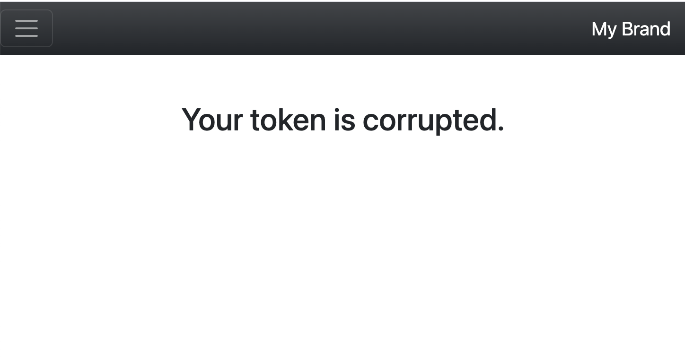

<h1 style="font-size: 50px; text-align: center;">CSRF Protection</h1>

## Table of contents
1. [Overview](#overview)
2. [Standard Form](#standard-form)
3. [Toggle Form](#toggle-form)
4. [References](#references)

<br>

## 1. Overview <a id="overview"></a><span style="float: right; font-size: 14px; padding-top: 15px;">[Table of Contents](#table-of-contents)</span>
This framework supports Cross-Site Request Forgery (CSRF) protection.  Every time a new session is started a new CSRF token is generated.  It is advised that users utilize CSRF checks for all actions associated with forms.  You can implement CSRF checks on all form submissions for submitting and deleting data.
<br>

## 2. Standard Form <a id="standard-form"></a><span style="float: right; font-size: 14px; padding-top: 15px;">[Table of Contents](#table-of-contents)</span>
For Any form you create you can add a CSRF token by adding the following statement to your form:

```php
<?= FormHelper::csrfInput() ?>
```

You can also use the shorthand globally accessible version of this function:
```php
<?= csrf() >
```

This statement will added a hidden element containing the session's CSRF token as its value.  Next, within the action associated with your form inside your controller class simply add the following statement:

```php
$this->request->csrfCheck();
```

The convention is to always add this statement immediately following the beginning of the if statement checking if data has been posted.  An example is shown below:

```php
if($this->request->isPost()) {
    $this->request->csrfCheck();
```

Following this procedure ensures that a CSRF check is performed before any processing of form data occurs.  If the CSRF token becomes corrupted the user is redirected to an error view that is shown below:

<div style="text-align: center;">
  
  <p style="font-style: italic;">Figure 1 - Corrupted token view</p>
</div>
<br>

## 3. Toggle Form <a id="toggle-form"></a><span style="float: right; font-size: 14px; padding-top: 15px;">[Table of Contents](#table-of-contents)</span>
The original framework that was started back in 2019 has an accompanying E-commerce site course.  One of the views contains lists of products in a table with a toggle featured for a featured field exposed as a styled star element.  Within this course the instructor uses a button for educational purposes. Whenever you need to toggle such elements a form can be used instead.

The original HTML for the toggled featured can be found at (A) in the References section.  Our modified version of this section is shown below:

```php
<form method="POST" 
    action="<?=route('vendorproducts.toggleFeatured')?>" 
    class="d-inline-block">
    <?= FormHelper::hidden('id', $product->id) ?>
    <?= $csrfToken = csrf() ?>
    <button type="submit" class="btn btn-sm btn-light btn-outline-warning" title="Toggle Featured">
        <i class="<?=($product->featured == 1) ? 'fas fa-star' : 'far fa-star'?>"></i>
    </button>
</form>
```

Instead of using an anchor element styled as a button we use a form.  A form for each product is rendered for each product in the table.  In the form we add a hidden element to tell the controller which product to modify.  Next we add the CSRF token.  Finally, we have a button styled as a start for submitting data.  The styling of the button depends on whether or not the product is featured.  

The controller action associated with this form is shown below:
```php
public function toggleFeaturedAction(): void {
    if($this->request->isPost()) {
        $this->request->csrfCheck();

        $id = $this->request->get('id');
        $product = Products::findByIdAndUserId($id, $this->user->id);

        if($product) {
            $product->featured = ($product->featured == 1)? 0 : 1;
            flashMessage(Session::SUCCESS, ($product->featured ==1)? "{$product->name} is now featured." : "{$product->name} is no longer featured.");
            $product->save();
        }
    }

    redirect('vendorproducts.index');
}
```

When compared to the original toggleFeaturedAction function found at (B) under the references section, this version does not contain responses to AJAX request and contains a call to perform a CSRF check.  This ensures the toggleFeaturedAction we implemented is more secure and does not have the added complexity associated with AJAX request and additional JavaScript.

We also use `flashMessage` instead of the sending messages back to the front end with a response to the AJAX request.  Finally, we redirect the user back to the same page since we are not updating the `featured` field without reloading the page.

We also use Forms with CSRF protection for deleting ACLs within this starter application.

<br>

## 4. References <a id="references"></a><span style="float: right; font-size: 14px; padding-top: 15px;">[Table of Contents]
* A. [Original toggle featured source code](https://bitbucket.org/parhamcurtis/live-ecommerce-youtube-course/src/master/app/views/adminproducts/index.php)
* B. [Original toggleFeaturedAction](https://bitbucket.org/parhamcurtis/live-ecommerce-youtube-course/src/master/app/controllers/AdminproductsController.php)
* B. [E-commerce Tutorial at FreeSkills](https://www.youtube.com/playlist?list=PLFPkAJFH7I0lVlYzLN-d26fscWAk30-2n)