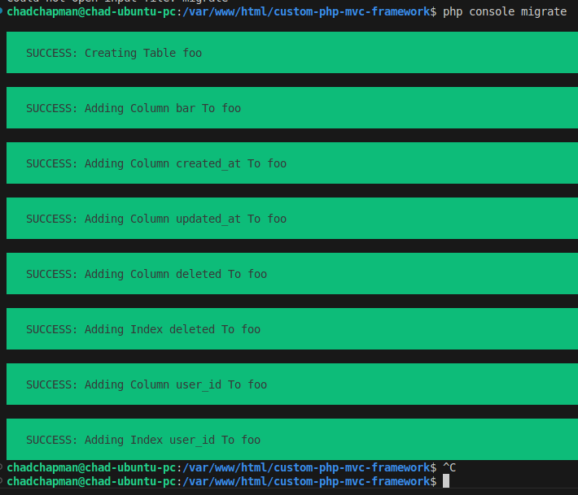
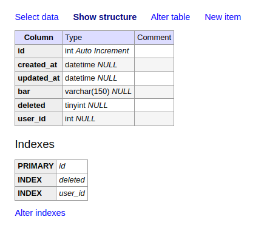

<h1 style="font-size: 50px; text-align: center;">Database Migrations and Operations</h1>

## Table of contents
1. [Overview](#overview)
2. [Migration](#migration)
3. [Creating and Managing Migrations](#creating-and-managing-migrations)  
  * A. [Creating a New Table](#creating-a-new-table)  
  * B. [Updating an Existing Table](#updating-an-existing-table)  
  * C. [Renaming an Existing Table](#renaming-an-existing-table)
  * D. [Dropping a Table](#dropping-a-table)  
  * E. [Renaming a Column](#renameing-column)
  * F. [Dropping Columns](#dropping-columns)
  * G. [After](#after)
  * H. [Migrations With Raw SQL Queries](#sql)
  * I. [Migration CLI Commands](#cli)
4. [Supported Field Types & Modifiers for Migrations](#field-types)
  * A. [Field Types](#types)
  * B. [Column Modifiers](#modifiers)
  * C. [Notes on Compatibility](#compatibility)
  * D. [Example Using Many Field Types](#example)
5. [Tips and Common Pitfalls](#tips)
6. [DB Class Reference](#db-class)
  * A. [getInstance](#get-instance)
  * B. [getPDO](#get-pdo)
  * C. [query](#query-method)
  * D. [groupByColumn](#groupby-column)
  * E. [results and first](#results-first)
  * F. [count and lastID](#count-lastid)
  * G. [find, findFirst, and findTotal](#find-methods)
  * H. [valueExistsInColumn](#value-exists)

<br>

## 1. Overview <a id="overview"></a><span style="float: right; font-size: 14px; padding-top: 15px;">[Table of Contents](#table-of-contents)</span>
Chappy.php supports full migration-based database management using its built-in CLI. This includes:
- Creating new tables
- Updating existing tables
- Dropping all tables
- Refreshing the schema

Migrations are managed using the `migrations` table, which keeps track of which files have been executed. This ensures that only **new** migration files are applied each time you run `php console migrate`.

Running this command with the `--seed` flag runs database seeders after all migrations are completed.
```bash
php console migrate --seed
```

To specify the name of a specific seeder class use the `--seeder` flag:

```sh
php console migrate --seed --seeder=MySeederName
```


To restore or generate built-in migrations use the following command:
```bash
php console migrate:restore
```

To specify the name of a specific seeder class use the `--seeder` flag:

```sh
php console migrate:restore --seed --seeder=MySeederName
```

This command accepts the following flags for restoring individual migration files:
- `--acl`
- `--email_attachments`
- `--migrations`
- `--profile_images`
- `--user_sessions`
- `--users`

<br>

## 2. Migration <a id="migration"></a><span style="float: right; font-size: 14px; padding-top: 15px;">[Table of Contents](#table-of-contents)</span>
Performing a database migration is one of the first tasks that is completed when setting up a project.  By default, the `.env` file is configured to use SQLite.  If you want to use a MySQL or MariaDB as your database you will have to update the `.env` file.  An example is shown below:

```sh
# Set to mysql or mariadb for production
DB_CONNECTION=mysql
DB_HOST=127.0.0.1
DB_PORT=3306
# Set to your database name for production
DB_DATABASE=my_db
DB_USER=root
DB_PASSWORD=my_secure-password
```

Next, create the database using your preferred method.  We like to use phpMyAdmin and Adminer.

Finally, you can run the migrate command shown below:

```php console migrate```

<br>

**Common Commands**
```php
# Run all pending migrations
php console migrate

# Refresh all tables (drop and re-run)
php console migrate:refresh

# Drop all tables without rerunning
php console migrate:drop:all
```

💡 The migrate:refresh command is great during local development when you want a clean slate.

<br>

## 3. Creating and Managing Migrations <a id="creating-and-managing-migrations"></a><span style="float: right; font-size: 14px; padding-top: 15px;">[Table of Contents](#table-of-contents)</span>

### A. Creating a New Table <a id="creating-a-new-table"></a>
Create a migration by running the make:migration command. An example is shown below for a table called foo:

```php console make:migration foo```

Once you perform this action a migration class is created with two functions called up and down. Up is used to create a new table or update an existing one. Down drops an existing table. We usually don't modify the down function. The output from the previous command is shown below:

```php
namespace Database\Migrations;
use Core\Lib\Database\Schema;
use Core\Lib\Database\Blueprint;
use Core\Lib\Database\Migration;

/**
 * Migration class for the foo table.
 */
class MDT20260211231125CreateFooTable extends Migration {
    /**
     * Performs a migration.
     *
     * @return void
     */
    public function up(): void {
        Schema::create('foo', function (Blueprint $table) {
          $table->id();

      });
    }

    /**
     * Undo a migration task.
     *
     * @return void
     */
    public function down(): void {
        Schema::dropIfExists('foo');
    }
}
```

The up function automatically creates a $table variable set to the value you entered when you ran the make:migration command along with a function call to create the table. In the code snippet below we added some fields.

```php
namespace Database\Migrations;
use Core\Lib\Database\Schema;
use Core\Lib\Database\Blueprint;
use Core\Lib\Database\Migration;

/**
 * Migration class for the foo table.
 */
class MDT20260211231125CreateFooTable extends Migration {
    /**
     * Performs a migration.
     *
     * @return void
     */
    public function up(): void {
        Schema::create('foo', function (Blueprint $table) {
            $table->id();
            $table->string('bar', 150)->nullable();
            $table->timestamps();
            $table->softDeletes();
            $table->integer('user_id');
            $table->index('user_id');
      });
    }

    /**
     * Undo a migration task.
     *
     * @return void
     */
    public function down(): void {
        Schema::dropIfExists('foo');
    }
}
```

<br>

**Common Field Methods**
- `$table->id()` — Creates an `id` column (auto-increment primary key)
- `$table->string('name', 255)` — Varchar column
- `$table->timestamps()` — Adds `created_at` and `updated_at`
- `$table->softDeletes()` — Adds `deleted_at` for soft deletion
- `$table->index('user_id')` — Adds an index
- `$table->string('bar', 25)->unique()` - Chaining the unique function makes a field unique.

Run the migration and the console output, if successful, will be shown below:

<div style="text-align: center;">
  
  <p style="font-style: italic;">Figure 1: Console output after running the migrate command.</p>
</div>

Open your database management software package and you will see that the table has been created.

<div style="text-align: center;">
  
  <p style="font-style: italic;">Figure 2 - New database table after migration was performed</p>
</div>

<br>

### B. Updating an Existing Table <a id="updating-an-existing-table"></a>
To add columns:

```sh
php console make:migration foo --update
```

Configure migration for update:

```php
public function up(): void {
    Schema::table('foo', function (Blueprint $table) {
        $table->string('bar', 150)->nullable()->default('Pending');
        $table->index('bar');
    });
}
```

Adding the `--update` flag generates a migration file for updating your table.

<br>

### C. Renaming an Existing Table <a id="renaming-an-existing-table"></a>
To rename an existing table:
```sh
php console make:migration bar --rename=foo
```

Resulting `up` function:
```php
public function up(): void {
    Schema::rename('bar', 'foo');
}
```

Adding the `--rename=foo` flag generates a migration file for renaming the table to `foo`.

<br>

### D. Dropping a Table <a id="dropping-a-table"></a>
You can drop a table manually using:

```php
Schema::dropIfExists('foo');
```

This is automatically included in your migrations class.

<br>

### E. Renaming a Column <a id="renaming-column"></a>
To rename an existing column use the renameColumn function:
```php
public function up(): void {
    Schema::table('test', function (Blueprint $table) {
        $table->renameColumn('foo', 'bar');
    });
}
```

All renaming functions accepts two arguments:
- `$from` - The column's original name
- `$to` - The column's new name

<br>

**Renaming indexes**

To rename a column that is indexed use the `renameIndex` function:
```php
public function up(): void {
    Schema::table('test', function (Blueprint $table) {

        $table->renameIndex('my_index', 'blah');
    });
}
```

<br>

**Renaming Primary Keys**

To rename a table's primary key use the `renamePrimaryKey` function:
```php
public function up(): void {
    Schema::table('test', function (Blueprint $table) {
        $table->renamePrimaryKey('id', 'id_new');
    });
}
```

<br>

**Rename Unique Constrained Columns**

To rename a column with a unique constraint use the `renameUnique` function:
```php
public function up(): void {
    Schema::table('test', function (Blueprint $table) {
        $table->renameUnique('bar', 'blah');
    });
}
```

<br>

**Rename Foreign Keys**

To rename a column with a foreign key constraint use the `renameForeign` function:
```php
public function up(): void {
    Schema::table('test', function (Blueprint $table) {
        $table->renameForeign('foreign_key', 'new_fk');
    });
}
```

<br>

### F. Dropping Columns <a id="dropping-columns"></a>
You can drop an individual column using the `dropColumns` function.
```php
$table->dropColumns('bar');
```

Multiple columns can be dropped by providing the column names as an array.
```php
$table->dropColumns(['foo', 'bar']);
```

This function checks if column is an index or primary key.  If these conditions are detected a warning is printed to the console and that field is skipped.

<br>

**Dropping Primary Keys**

To drop a primary key use the `dropPrimaryKey` function.

```php
public function up(): void {
    Schema::table('test', function (Blueprint $table) {
        $table->dropPrimaryKey('id');
    });
}
```

This function accepts two arguments:
- `$column` - The name of the column to be dropped.
- `$preserveColumn` - A boolean flag that defaults to true.  Set to true if you want to keep the column and drop only the foreign key constraint.  The default value is true.

<br>

**Dropping Indexes**

To drop an indexed value use the `dropIndex` function.

```php
public function up(): void {
    Schema::table('test', function (Blueprint $table) {
        $table->dropIndex('my_index', true);
    });
}
```

This function accepts two arguments:
- `$column` - The name of the column to be dropped.
- `$preserveColumn` - A boolean flag that defaults to true.  Set to true if you want to keep the column and drop only the primary key constraint.  The default value is true.

<br>

**Dropping Unique Constrained Columns**

To drop a column with the unique constraint use the `dropUnique` function.

```php
public function up(): void {
    Schema::table('test', function (Blueprint $table) {
        $table->dropUnique('bar', true);
    });
}
```

This function accepts two arguments:
- `$column` - The name of the column to be dropped.
- `$preserveColumn` - A boolean flag that defaults to true.  Set to true if you want to keep the column and drop only the unique index constraint.  The default value is true.

<br>

**Dropping Foreign Keys**

To drop a foreign key use the `dropForeign` function (MySQL only).

```php
public function up(): void {
    Schema::table('test', function (Blueprint $table) {
        $table->dropForeign('my_foreign_key', true);
    });
}
```

This function accepts two arguments:
- `$column` - The name of the column to be dropped.
- `$preserveColumn` - A boolean flag that defaults to true.  Set to true if you want to keep the column and drop only the foreign key constraint.  The default value is true.

<br>

### G. After <a id="after">
Add a column after a specific column:
```php
public function up(): void {
    Schema::table('users', function (Blueprint $table) {
        $table->string('test')->after('password');
    });
}
```

This function accepts one argument:
- `$column` - The name of the column we will add after

<br>

### H. Migrations With Raw SQL Queries <a id="sql"></a>
You are able to perform raw SQL queries within a migration.  You can create or update a table and then use SQL queries to add values.  This is useful if your database table already has data.

<br>

**Example:**
```php
public function up(): void {
    $sql = "UPDATE products SET `has_options` = 0, `inventory` = 0";
    DB::getInstance()->query($sql);
}
```

As shown above, create your SQL statement and then chain the `query` function to a static call to the `getInstance` variable.  You can also do this after a call to the `Schema::create` or `Schema::table` static function calls.

<br>

### I. Migration CLI Commands <a id="cli"></a>
#### 1. `make:migration`
Generates a new migration class.
```sh
php console make:migration foo
```

<br>

**Rename Example**

Generates a migration class for renaming a table.
```sh
php console make:migration foo --rename=bar
```
`foo` is the original and `bar` will be its new name.

<br>

**Update Example**

Generates a migration class for updating a table.
```sh
php console make:migration foo--update
```

<br>

#### 2. `migrate`
Performs all pending migrations.

<br>

**Seed Example**

Use the `--seed` flag to seed your database after migrations have completed.
```sh
php console migrate:fresh --seed
```

To specify the name of a specific seeder class use the `--seeder` flag:

```sh
php console migrate:fresh --seed --seeder=MySeederName
```

<a id="drop-all"></a>

<br>

#### 3. `migrate:drop:all`
Drops all tables.
<a id="migrate-fresh"></a>

<br>

#### 4. `migrate:fresh`
Drops all tables and performs migration.

<br>

**Seed Example**

Use the `--seed` flag to seed your database after migrations have completed.
```sh
php console migrate:fresh --seed
```
<a id="migrate-refresh"></a>

<br>

#### 5. `migrate:refresh`
Drops all tables one at a time and performs migration.  

<br>

**Seed Example**

Use the `--seed` flag to seed your database after migrations have completed.
```sh
php console migrate:refresh --seed
```

<br>

**Step Example**

```sh
php console migrate:refresh --step=2
```
Undo last 2 previous migration and then runs migration against all pending migrations.
<a id="rollback"></a>

<br>

#### 6. `migrate:rollback`
Performs a roll back of the last batch of migrations.
```sh
php console rollback
```

<br>

**Batch Example**
```sh
php console migrate:rollback --batch=2
```
Roll back migrations for batch number 2

<br>

**Step Example**
```sh
php console migrate:rollback --step=2
```
Undo last 2 previous migrations.
<a id="status"></a>

<br>

#### 7. `migrate:status`
Displays status of ran and pending migrations.

<br>

## 4. Supported Field Types & Modifiers for Migrations <a id="field-types"></a><span style="float: right; font-size: 14px; padding-top: 15px;">[Table of Contents](#table-of-contents)</span>
Chappy.php’s migration system includes a flexible schema builder via the Blueprint class. It supports most standard SQL column types, modifiers, and constraints across both MySQL and SQLite databases. The table below outlines supported fields and how to define them.

<br>

### A. Field Types <a id="types"></a>

| Modifier | Description |
|:--------:|-------------|
| `id()` | Adds a primary key (`AUTO_INCREMENT` or `AUTOINCREMENT`) |
| `string('name', 255)`	| Adds a `VARCHAR` field (or `TEXT` for SQLite) |
| `text('description')` | Adds a `TEXT` field |
| `integer('age')` | Adds an `INT` (or `INTEGER` on SQLite) |
| `bigInteger('views')`	| Adds a `BIGINT` field |
| `mediumInteger('count')` | Adds a `MEDIUMINT` field |
| `smallInteger('flag')` | Adds a `SMALLINT` field |
| `tinyInteger('bool_flag')` | Adds a `TINYINT` (or `INTEGER` on SQLite) |
| `unsignedInteger('num')` | Adds `UNSIGNED INT` (MySQL only) or `INTEGER` (SQLite) |
| `unsignedBigInteger('num)` | Adds `BIGINT  UNSIGNED` (mYsql only) or `BIGINT` (SQLite) |
| `decimal('amount', 10, 2)` | Adds a `DECIMAL` field with precision and scale |
| `float('ratio', 8, 2)` | Adds a `FLOAT` field |
| `double('rate', 16, 4)`	| Adds a `DOUBLE` field |
| `boolean('active')`	| Adds a `TINYINT(1)` to represent boolean values |
| `date('start_date')` | Adds a `DATE` field |
| `datetime('event_time')` | Adds a `DATETIME` field |
| `time('alarm')`	| Adds a `TIME `field |
| `timestamp('published_at')`	| Adds a `TIMESTAMP` field |
| `timestamps()` | Adds `created_at` and `updated_at` fields |
| `softDeletes()` | Adds a soft delete `deleted` field |
| `enum('status', [...])`	| Adds an `ENUM` (MySQL only, falls back to `TEXT` in SQLite) |
| `uuid('uuid')` | Adds a `CHAR(36)` for UUIDs (or `TEXT` in SQLite) |

<br>

### B. Column Modifiers <a id="modifiers"></a>

| Modifier | Description |
|:--------:|-------------|
| `nullable()` | Makes the column `NULL`-able |
| `default('value')` | Assigns a default value to the most recent column |
| `index('column')` | Adds an index to the specified column |
| `foreign('col', 'id', 'table')`	| Adds a foreign key constraint (MySQL only) |

<br>

### C. Notes on Compatibility <a id="compatibility"></a>
- MySQL: All features are supported, including foreign keys and `ENUM`.
- SQLite: Lacks native support for `ENUM`, foreign keys (unless enabled), and strict `UNSIGNED` types. Your migration code gracefully degrades in these cases.

<br>

### D. Example Using Many Field Types <a id="example"></a>
```php
Schema::create('products', function(Blueprint $table) {
    $table->id();
    $table->string('name', 255)->default('Unnamed');
    $table->decimal('price', 10, 2)->nullable();
    $table->boolean('in_stock')->default(true);
    $table->unsignedInteger('category_id');
    $table->foreign('category_id', 'id', 'categories');
    $table->timestamps();
    $table->softDeletes();
});
```

🔐 Reminder: Use foreign keys only when using MySQL. They’ll be ignored silently on SQLite.

<br>

## 5. Tips and Common Pitfalls <a id="tips"></a><span style="float: right; font-size: 14px; padding-top: 15px;">[Table of Contents](#table-of-contents)</span>
- Use `nullable()->default()` to safely add optional fields.
- **Foreign keys and ENUM** types are only supported in MySQL.
- **SQLite** ignores unsupported column modifiers silently.
- Always verify your migrations using a database viewer like phpMyAdmin or SQLiteBrowser.
- Log messages in the CLI will show `SUCCESS: Adding Column..`. or `SUCCESS: Creating Table....`

<br>

## 6. DB Class Reference <a id="db-class"></a><span style="float: right; font-size: 14px; padding-top: 15px;">Table of Contents</span>
The `DB` class in Chappy.php is a singleton-based database utility that wraps PDO functionality and adds query building, logging, and utility helpers.

### A. `getInstance()` <a id="get-instance"></a>
```php
DB::getInstance(): DB
```

Returns:
- `DB` - A singleton instance of the DB class. Used to initiate or access the shared database connection.

<br>

**Example:**
```php
$db = DB::getInstance();
```

<br>

### B. `getPDO()` <a id="get-pdo"></a>
```php
getPDO(): PDO
```

Returns:
- `PDO` -  the raw PDO instance. Useful for advanced operations or custom queries not handled by the built-in query method.

<br>

**Example**
```php
$dbDriver = DB::getInstance()->getPDO()->getAttribute(\PDO::ATTR_DRIVER_NAME);
```
Here we chain the getPDO function to getInstance.  Then we chain the getAttribute function to getPDO to retrieve the name of the current DB driver.

<br>

### C. `query()` <a id="query-method"></a>
Prepares, binds, and executes a SQL query.

Parameters:
- `$sql` - Raw SQL string
- `$params` - Array of bound values
- `$class` - Optional class name to map results

Returns: 
- `DB` - Instance with result data loaded

<br>

### D. `groupByColumn()` <a id="groupby-column"></a>
Formats a column name for use in a `GROUP BY` clause. On MySQL or MariaDB, wraps the column in `ANY_VALUE()` to prevent `ONLY_FULL_GROUP_BY` errors.

Parameter:
- `string $column` - Name of the column to format.

Returns:
- `string|null` - The property formatted column inf DB driver is properly set or detected.  Otherwise, we return null.

Example:
```php
$col = DB::groupByColumn('users.name');
```

<br>

### E. `results()` and `first()` <a id="results-first"></a>
**`results()`**
Returns all rows from the last query

Returns:
- `array` - An array of objects that contain results of a database query.

<br>

**`findFirst()`**
Returns only the first row of the last query

Parameters:
- `string $table` - The name or the table we want to perform our query against.
- `array $params` - An associative array that contains key value pair  parameters for our query such as conditions, bind, limit, offset,  join, order, and sort.  The default value is an empty array.
- `bool|string` - $class A default value of false, it contains the name of the class we will build based on the name of a model.

Returns:
- `array|object|bool` - An associative array of results returned from an SQL  query.

<br>

### F. `count()` and `lastID()` <a id="count-lastid"></a>
**`count()`**
Number of rows affected or returned by the last query.

Returns:
- `int`- The number of results found in an SQL query.

<br>

**`lastID()`**
The primary key ID of the last insert operation.

Returns:
-`int|string|null` - The primary key ID from the last insert operation.

<br>

### G. `find()`, `findFirst()`, and `findTotal()` <a id="find-methods"></a>
**`find()`**
Performs find operation against the database.  The user can use parameters such as conditions, bind, order, limit, and sort.

Parameters:
- `string $table` - The name or the table we want to perform our query against
- `array $params` - An associative array that contains key value pair parameters for our query such as conditions, bind, limit, offset, join, order, and sort.  The default value is an empty array.
- `bool|string $class` - A default value of false, it contains the name of the class we will build based on the name of a model.

Returns:
- `bool|array` -  An array of object returned from an SQL query.

Example:
```php
$contacts = $db->find('users', [
    'conditions' => ["email = ?"],
    'bind' => ['chad.chapman@email.com'],
    'order' => "username",
    'limit' => 5,
    'sort' => 'DESC'
]);
```

<br>

**`findFirst()`**
Returns only the first row of the last query.

Parameters:
- `string $table` - The name or the table we want to perform our query against
- `array $params` - An associative array that contains key value pair parameters for our query such as conditions, bind, limit, offset, join, order, and sort.  The default value is an empty array.
- `bool|string $class` - A default value of false, it contains the name of the class we will build based on the name of a model.

Returns:
- `bool|array` -  An array of object returned from an SQL query.

<br>

**`findTotal()`**
Returns number of records in a table.

Parameters:
- `string $table` - The name or the table we want to perform our query against
- `array $params` - An associative array that contains key value pair parameters for our query such as conditions, bind, limit, offset, join, order, and sort.  The default value is an empty array.

Returns:
- `int` - The number of records in a table.

<br>

### H. `valueExistsInColumn()` <a id="value-exists"></a>
Checks if a value exists inside a JSON or string column. Compatible with both MySQL (uses `JSON_CONTAINS`) and SQLite (uses `LIKE`).