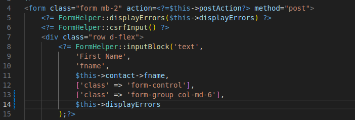

<h1 style="font-size: 50px; text-align: center;">Server Side Validation</h1>

## Table of contents
1. [Overview](#overview)
2. [Setup](#setup)
3. [Validation Rules](#validation-rules)
4. [Custom Validators](#custom-validators)
5. [Composite Field Validation](#composite-field-validation)
6. [Why Front-End Validation Matters](#front-end)

<br>

## 1. Overview <a id="overview"></a><span style="float: right; font-size: 14px; padding-top: 15px;">[Table of Contents](#table-of-contents)</span>

| Validator | Description |
|:---------:|-------------|
| `Email` | Validates that input is in a valid email format |
| `LowerCharacter` | Requires at least one lowercase letter |
| `Matches` | Confirms two fields match (e.g., password + confirm password) |
| `Max` | Enforces maximum length/value (`rule` is required) | 
| `Min` | Enforces minimum length/value (`rule` is required) |
| `Number` | Requires at least one digit |
| `Numeric` | Ensures input contains only numeric characters |
| `PhoneNumber` | Ensures phone numbers are properly formatted based on locality (`rule` is required to set locale) |
| `Required` | Field must not be empty |
| `Special` | Requires at least one special (non-space) character |
| `Unique` | Ensures value is unique in the database |
| `UpperCharacter` | Requires at least one uppercase letter |

<br>

## 2. Setup <a id="setup"></a><span style="float: right; font-size: 14px; padding-top: 15px;">[Table of Contents](#table-of-contents)</span>
Use the `validator()` method in your model and call it automatically when save() is invoked.  Let's use the addAction function from an example ContactsController class. As shown below on line 32, we have a displayErrors property for the View class. We generally set this value to a function call called getErrorMessages on the model. In this case, we are using the $contacts model because we want to add a new contact.

<div style="text-align: center;">
  
  <p style="font-style: italic;">Figure 1 - Controller side setup</p>
</div>

In the form you have two ways display errors:
1. At the top of the form (general errors).  You can also use the globally declared version called `errorBag`.
2. Inline with input elements (specific field errors).

The form setup is shown below in figure 2.

<div style="text-align: center;">
  
  <p style="font-style: italic;">Figure 2 - Form setup</p>
</div>

The result of submitting a form without entering required input is shown below. Note the box above all for elements. All action items will be listed here. Notice that since we added $this->displayErrors as an argument for the FormHelper::inputBlock for first name that the same message is below it as well along with styling around the input field.

<div style="text-align: center;">
  
  <p style="font-style: italic;">Figure 3 - Front end messages</p>
</div>
<br>

<br>

## 3. Validation Rules <a id="validation-rules"></a><span style="float: right; font-size: 14px; padding-top: 15px;">[Table of Contents](#table-of-contents)</span>
**Validator Method**

Each model defines its own validator() method:

```php
public function validator(): void {
    // Enter your validation function calls here.
}
```

You can easily create a model with this function already created from the console by running the following command:

```sh
php console make:model ${Modelname}
```

<br>

**Individual Rule Example**

Let's use the MaxValidator for the First Name field in the Contacts model as an example:

```php
$this->runValidation(new MaxValidator( $this, [
  'field' => 'fname', 
  'rule' => 150, 'message' => 'First name must be less than 150 characters.'
]));
```

Parameters:
- `field`: model property (must exist in the class)
- `rule`: validator-specific value (e.g., max length)
- `message`: error shown to the user

<br>

**Looping Through Fields**

You can also group several fields together and iterate through them with a foreach loop:

```php
$requiredFields = [
  'fname' => 'First Name', 
  'lname' => 'Last Name', 
  'address' => 'Address', 
  'city' => 'City', 
  'state' => 'State', 
  'zip' => 'Zip', 
  'email' => 'Email'
];

foreach($requiredFields as $field => $display) {
    $this->runValidation(new RequiredValidator($this,[
      'field'=>$field,
      'message'=>$display." is required."
    ]));
}
```

This method requires a second associative array that contains the instance variables for your model mapped to a string that matches the label on your form. Then you iterate this array through a foreach loop where you create a new instance for the validator object you want to use.

<br>

**Include Soft-Deleted Records**

Some validators like `UniqueValidator` accept an optional `includeDeleted` flag:
```php
$this->runValidation(new UniqueValidator($this, [
    'field' => 'username',
    'message' => 'This username already exists.',
    'includeDeleted' => true
]));
```


## 4. Custom Validators <a id="custom-validators"></a><span style="float: right; font-size: 14px; padding-top: 15px;">[Table of Contents](#table-of-contents)</span>
You can create your own custom form validators with the following command:

```sh
php console make:validator ${validator_name}
```

An example output after running the command is shown below:
```php
<?php
namespace App\Lib\Validators;
use Core\Validators\CustomValidator;
/**
 * Describe your validator class.
 */
class TestValidator extends CustomValidator {

    /**
     * Describe your function.
     * 
     * @return bool
     */ 
    public function runValidation(): bool {
        // Implement your custom validator.
    }
}
```

- Must implement runValidation()
- Must return true or false
- Will be automatically executed by your model’s save() method

<br>

**CustomValidator Base Class Highlights**
- Ensures `field` and `message` are provided
- Supports `rule` and `includeDeleted` as optional parameters
- Automatically populates `$success` based on result of `runValidation()`
- Throws descriptive errors if setup is incorrect

<br>

## 5. Composite Field Validation <a id="composite-field-validation"></a><span style="float: right; font-size: 14px; padding-top: 15px;">[Table of Contents](#table-of-contents)</span>
The Chappy.php framework supports composite validation rules — where more than one field is used to determine uniqueness. This is useful for soft-deleted records or user-specific data.

<br>

**Example:**
```php
public function validator(): void {
    $this->runValidation(new Required($this, [
      'field' => 'name', 
      'message' => 'Brand name is required.'
    ]));
    
    // Ensure brand name is unique per user where the brand is not soft-deleted (deleted = 0).
    $this->runValidation(new Unique($this, [
      'field' => ['name', 'user_id', 'deleted'], 
      'message' => 'That brand already exists.'
    ]));
}
```

<br>

**How it works:**
- The Unique validator detects when field is an array.
- Internally, the first field becomes the primary field (name) and the others are used as additional constraints (user_id, deleted).
- This produces a query like:
```sql
SELECT * FROM brands 
  WHERE name = :name AND user_id = :user_id AND deleted = :deleted
```
- If a record matches all fields, validation fails and the error message is shown.

This feature enables unique validation within scope, like unique brand names per user, while respecting soft-deletion.

<br>

## 6. Why Front-End Validation Matters <a id="front-end"></a><span style="float: right; font-size: 14px; padding-top: 15px;">[Table of Contents](#table-of-contents)</span>
While server-side validation is essential for application security and enforcing business rules, front-end validation enhances the user experience by providing instant feedback. Common examples include:
- Realtime password match checks
- Enforcing required fields before submission
- Format validation (e.g., email, phone numbers)

This framework includes JavaScript tools (see the [JavaScript and Vite section](javascript)) that support these features. For production-ready apps, always use both front-end and server-side validation together.

To include attributes for HTML5-based validation, use the `$inputAttrs` array in the form helper functions:
```php
FormHelper::inputBlock('text', 'State', 'state', $this->contact->state, [
    'class' => 'form-control',
    'pattern' => '[A-Z]*',
    'placeholder' => 'ex: VA'
], ['class' => 'form-group col-md-3'], $this->displayErrors);
```

In this case:
- `pattern` enforces all-uppercase state abbreviations
- `placeholder` gives users an example

Another example for ZIP code:
```php
FormHelper::inputBlock('text', 'Zip', 'zip', $this->contact->zip, [
    'class' => 'form-control',
    'pattern' => '[0-9]*',
    'placeholder' => 'ex: 90210'
], ['class' => 'form-group col-md-4'], $this->displayErrors);
```

JavaScript enhancements like password match validation can be injected into HTML automatically:

```php
<script src="<?=Env::get('APP_DOMAIN', '/')?>resources/js/frontEndPasswordMatchValidate.js"></script>
```
